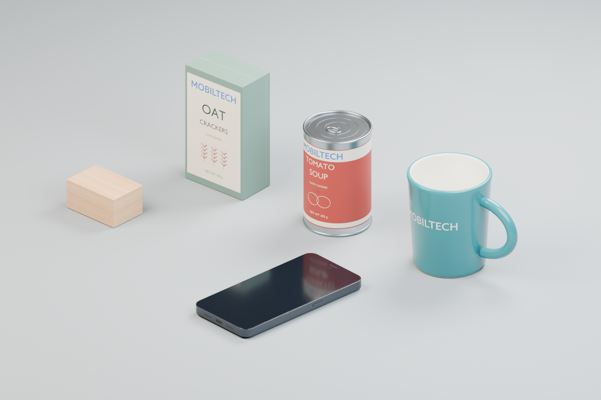

# Replica City AI Generated Assets

User-defined collection name. Stable ID: `replica_city_ai_generated_assets`.
Current release: **1.1.0 — MOBILTECH branding and reference-based masses**.

For future research, refer to **Replica City AI Generated Assets v1.1.0** and
the individual asset ID. The folder remains `assets/grasp_set_v1/` for backward
compatibility. See `collection.json` for machine-readable entrypoints. This
collection is separate from the original ReplicaCity/NAS asset library.

Five new assets for rigid-body manipulation research. Each includes editable
Blender geometry, portable OpenUSD/PBR materials, separate convex collision
geometry, semantic class labels, mass/COM/inertia estimates, and previews.

MOBILTECH's official vector wordmark is included on the carton, can and mug.
Masses now use documented real-world references and calculations; see
[mass values and branding sources](MASS_AND_BRANDING.md).

**Current status:** USD checks pass for all five assets, including revised mass
and inertia. The post-update Isaac regression passes **13/15** drops: wood,
carton, can and mug each pass 3/3; phone passes 1/3. The phone's other two poses
fail only the 0.100 rad/s resting angular-speed limit (0.124 and 0.143 rad/s).
Its contact, translation and penetration checks pass, but it still needs
resting-contact tuning before use as a stable research baseline. Mug cavity
and handle-opening checks pass. Robot grasping is not yet tested.



## Open the set

- **Isaac Sim:** open `grasp_set_isaac.usda`. This is a fresh demo stage containing
  all five dynamic objects, a static floor, lighting, camera and physics scene.
  Select `/World/catalog_camera` for the catalog view, then Play for physics.
- **Blender:** open `showcase.blend`. Individual `authoring.blend` files
  are scene libraries: use File > Append > authoring.blend > Scene,
  append the research scene and select it in Blender.
- **Your robot scene:** reference `<asset_id>/<asset_id>_isaac.usda` under a new
  prim. It has exactly one dynamic rigid body; do not add another rigid body to
  an ancestor or child. Move the referenced root, and keep its scale at 1.
- **Other USD tools:** use `<asset_id>/<asset_id>.usda`, the engine-neutral
  USDPhysics entrypoint. Do not use `visual.usdc` alone for simulation.

The individual assets contain no camera, light, floor or physics scene. Copy an
entire asset folder, not only its entrypoint. All runtime dependencies are local
relative references. The top-level demo requires all five folders.

## Objects

Dimensions are approximate outer visual dimensions, including small details.
Masses are **reference-based estimates**, not measurements of physical specimens.

| Object / folder | Dimensions (mm) | Mass | Contact geometry | Useful grasp challenge |
|---|---:|---:|---|---|
| `wood_block_001` | 60 × 40 × 30 | 51.84 g | 1 box | Baseline parallel-jaw grasp |
| `food_carton_001` | 70 × 40.4 × 120 | 165 g filled | 1 box | Tall, lightweight rectangular object |
| `food_can_001` | Ø65 × 100 | 349 g filled | 1 convex cylinder proxy | Cylindrical grasp and rolling |
| `ceramic_mug_001` | 117 × 80 × 95 | 295 g empty | 73 convex parts | Handle, hollow cavity, asymmetric COM |
| `cell_phone_001` | 75 × 152.1 × 10.55 | 187 g | 7 convex parts | Thin edge grasp and camera bump |

The mug is empty, carton/can are sealed rigid approximations, and the phone is
unbranded with its screen off. The mug handle points +X; package fronts face −Y;
the phone screen faces +Z and its camera bump is underneath. Each origin is at
the object's nominal bottom plane, not necessarily its COM.

## Conventions and files

- Lowercase underscore asset identifiers, meter units, kilogram mass units,
  Z-up, a default prim and `component` kind.
- Root dynamic rigid body; separate `visuals`, `colliders`, and physics material.
- `UsdPreviewSurface` materials exported from Blender Principled materials.
  UVs are present; only the wood needs an external texture. Labels are meshes,
  so fonts and procedural Blender shaders are not external dependencies.
- Colliders are invisible guide-purpose meshes; enable collision debug drawing
  in Isaac to inspect them. Never replace the whole mug with one convex hull:
  that would close its cavity and handle opening.

Each folder contains:

```text
<asset_id>.usda          portable composition entrypoint
<asset_id>_isaac.usda    entrypoint with the tested PhysX precision profile
visual.usdc             mesh geometry and visual materials
physics.usda            engine-neutral USDPhysics and semantic labels
isaac_physics.usda      optional PhysX solver/contact overrides
authoring.blend         editable visual source (physics is authored in USD)
asset_info.json         reference-based masses, physical estimates and provenance
usd_validation.json    static validation and dimensions
preview.png            actual mesh render
textures/              wood base-color image, for the wood asset only
```

No existing ReplicaCity package was modified. The separate reference audit
remains in the original workspace and is not part of this repository.

## Verification and test scope

`manifest.json` records static checks, relocation tests, source hashes and the
final Isaac result. `validation/isaac_physics_validation.json` contains the
per-trial measured values and pass/fail checks.

- Five portable entrypoints and five Isaac entrypoints were opened after being
  copied to a temporary directory; no missing or outside-package dependencies.
- Static checks cover units, one dynamic rigid body, positive mass/inertia,
  closed proxy meshes, visual material bindings and near-zero bottom plane.
- Isaac Sim 6.0.0.1: three drop orientations per object, 5 cm initial clearance,
  480 Hz physics, six simulated seconds per trial, on a static floor.
- Checks include actual dropping, no fall-through, near-floor contact,
  finite state, last-second settling, linear/angular speed and contact forces.
- A 5 mm-radius sphere tests the mug cavity floor; a collision ray tests that
  the handle center stays open.

The optional Isaac profile uses **16 position / 4 velocity solver iterations**,
**1 mm contact offset** and **0 rest offset**. The demo physics scene uses **480 Hz**;
set your own simulation to that rate to reproduce the test. This is a precision-oriented
starting profile, not a throughput benchmark. The detailed mug collider may be
expensive for thousands of parallel environments.

Passing these checks is not formal SimReady certification. No robot has yet
grasped these assets. Before sim-to-real experiments, measure the actual objects
and calibrate mass, inertia, contact friction and gripper compliance. Transparent
or specular RGB-D sensing, breakage and deformation are not validated here.

## Reproduce checks

From the repository root, run the included read-only integrity/dependency checker:

```bash
python3 scripts/verify_asset_release.py --assets assets/grasp_set_v1
# In a Python environment that provides OpenUSD (pxr):
python3 scripts/verify_asset_release.py --assets assets/grasp_set_v1 --usd
```

To repeat the drop/contact test, run `scripts/test_grasp_assets_isaac.py` with your
configured Isaac Sim Python launcher, passing:

```text
--assets assets/grasp_set_v1 --out artifacts/isaac_retest --physics-hz 480
```

The test starts a fresh headless simulation and writes results to the output
directory; use a new output directory to retain previous results. A nonzero
exit status is expected when a contact/settling check fails. It does not alter
the delivered asset files. No Blender, Isaac Sim or model server is bundled.

Editable Blender sources and original branding/texture resources are included.
Private Qwen worker logs, machine-specific build scripts and the authoring
orchestration environment remain in the original workspace and are not needed
to load these assets.

See [provenance and wood-texture prompt](PROVENANCE.md) for authoring roles,
generated texture provenance, worker limitations, physical assumptions and
validation history.

Relevant technical references: [OpenUSD rigid-body physics](https://openusd.org/release/api/usd_physics_page_front.html),
[Isaac simulation fundamentals](https://docs.isaacsim.omniverse.nvidia.com/latest/physics/simulation_fundamentals.html),
[SimReady modeling guidance](https://docs.omniverse.nvidia.com/simready/latest/simready-asset-creation/modeling-best-practices.html).
